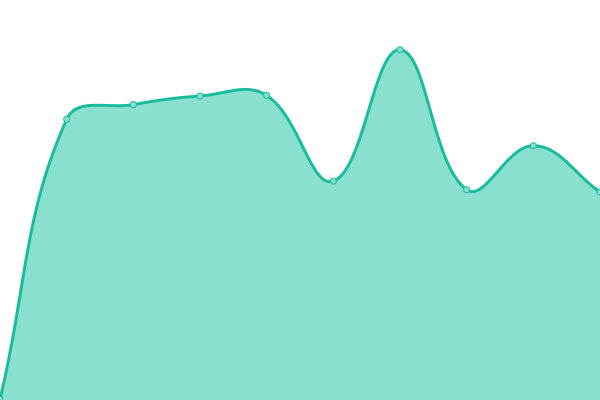

# [📈 Live Status](https://status.busby.io): <!--live status--> **🟧 Partial outage**

This repository contains the open-source uptime monitor and status page for [K-Safe Ltd](http://www.k-safe.com), powered by [Upptime](https://github.com/upptime/upptime).

(https://status.busby.io) for the status page.

<!--start: status pages-->
<!-- This summary is generated by Upptime (https://github.com/upptime/upptime) -->
<!-- Do not edit this manually, your changes will be overwritten -->
<!-- prettier-ignore -->
| URL | Status | History | Response Time | Uptime |
| --- | ------ | ------- | ------------- | ------ |
|  Busby Main Site | 🟩 Up | [busby-main-site.yml](https://github.com/k-safe/upptime/commits/HEAD/history/busby-main-site.yml) | 

 1648ms
     
 | 

<a href="https://status.busby.io/history/busby-main-site">100.00%</a>
    

|  Busby Insights | 🟩 Up | [busby-insights.yml](https://github.com/k-safe/upptime/commits/HEAD/history/busby-insights.yml) | 

 809ms
     
 | 

<a href="https://status.busby.io/history/busby-insights">100.00%</a>
    

|  Busby Ideas | 🟩 Up | [busby-ideas.yml](https://github.com/k-safe/upptime/commits/HEAD/history/busby-ideas.yml) | 

 524ms
     
 | 

<a href="https://status.busby.io/history/busby-ideas">100.00%</a>
    

|  Busby Partner Portal | 🟩 Up | [busby-partner-portal.yml](https://github.com/k-safe/upptime/commits/HEAD/history/busby-partner-portal.yml) | 

 155ms
     
 | 

<a href="https://status.busby.io/history/busby-partner-portal">100.00%</a>
    

|  Busby Support | 🟥 Down | [busby-support.yml](https://github.com/k-safe/upptime/commits/HEAD/history/busby-support.yml) | 

 433ms
     
 | 

<a href="https://status.busby.io/history/busby-support">100.00%</a>
    

|  Busby Marketplace | 🟩 Up | [busby-marketplace.yml](https://github.com/k-safe/upptime/commits/HEAD/history/busby-marketplace.yml) | 

 506ms
     
 | 

<a href="https://status.busby.io/history/busby-marketplace">100.00%</a>
    

|  Busby Vault | 🟩 Up | [busby-vault.yml](https://github.com/k-safe/upptime/commits/HEAD/history/busby-vault.yml) | 

 464ms
     
 | 

<a href="https://status.busby.io/history/busby-vault">100.00%</a>
    

<!--end: status pages-->

[**Visit our status website →**](https://status.busby.io)

## 📄 License

- Powered by: [Upptime](https://github.com/upptime/upptime)
- Code: [MIT](./LICENSE) © [K-Safe Ltd.](http://www.k-safe.com)
- Data in the `./history` directory: [Open Database License](https://opendatacommons.org/licenses/odbl/1-0/)
