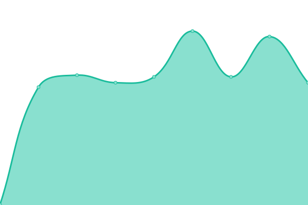

# [📈 Live Status](https://status.Flaresafety.com): <!--live status--> **🟩 All systems operational**

This repository contains the open-source uptime monitor and status page for [K-Safe Ltd](http://www.k-safe.com), powered by [Upptime](https://github.com/upptime/upptime).

(https://status.flaresafety.com) for the status page.

<!--start: status pages-->
<!-- This summary is generated by Upptime (https://github.com/upptime/upptime) -->
<!-- Do not edit this manually, your changes will be overwritten -->
<!-- prettier-ignore -->
| URL | Status | History | Response Time | Uptime |
| --- | ------ | ------- | ------------- | ------ |
|  Flare Main Site | 🟩 Up | [flare-main-site.yml](https://github.com/k-safe/upptime/commits/HEAD/history/flare-main-site.yml) | 

 836ms
     
 | 

<a href="https://status.flaresafety.com/history/flare-main-site">99.70%</a>
    

|  Flare Insights | 🟩 Up | [flare-insights.yml](https://github.com/k-safe/upptime/commits/HEAD/history/flare-insights.yml) | 

 819ms
     
 | 

<a href="https://status.flaresafety.com/history/flare-insights">100.00%</a>
    

|  Busby Ideas | 🟩 Up | [busby-ideas.yml](https://github.com/k-safe/upptime/commits/HEAD/history/busby-ideas.yml) | 

 477ms
     
 | 

<a href="https://status.flaresafety.com/history/busby-ideas">100.00%</a>
    

|  Flare Partner Portal | 🟩 Up | [flare-partner-portal.yml](https://github.com/k-safe/upptime/commits/HEAD/history/flare-partner-portal.yml) | 

 130ms
     
 | 

<a href="https://status.flaresafety.com/history/flare-partner-portal">93.40%</a>
    

|  Flare Support | 🟩 Up | [flare-support.yml](https://github.com/k-safe/upptime/commits/HEAD/history/flare-support.yml) | 

 181ms
     
 | 

<a href="https://status.flaresafety.com/history/flare-support">100.00%</a>
    

|  Flare Marketplace | 🟩 Up | [flare-marketplace.yml](https://github.com/k-safe/upptime/commits/HEAD/history/flare-marketplace.yml) | 

 463ms
     
 | 

<a href="https://status.flaresafety.com/history/flare-marketplace">100.00%</a>
    

|  Vault | 🟩 Up | [vault.yml](https://github.com/k-safe/upptime/commits/HEAD/history/vault.yml) | 

 399ms
     
 | 

<a href="https://status.flaresafety.com/history/vault">100.00%</a>
    

<!--end: status pages-->

[**Visit our status website →**](https://status.flaresafety.com)

## 📄 License

- Powered by: [Upptime](https://github.com/upptime/upptime)
- Code: [MIT](./LICENSE) © [K-Safe Ltd.](http://www.k-safe.com)
- Data in the `./history` directory: [Open Database License](https://opendatacommons.org/licenses/odbl/1-0/)
